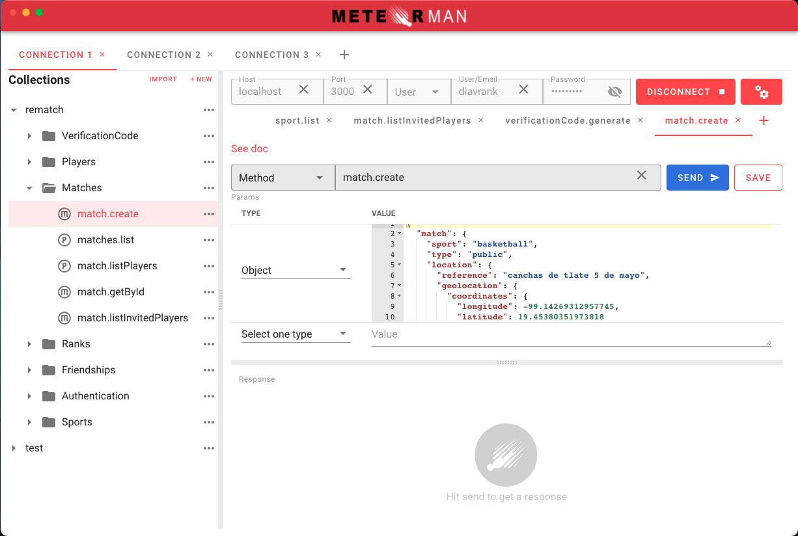

<div align="center">
<br>

<br>
<br>
</div>

<p align="center" color="#6a737d">
A DDP Client with GUI
</p>

<div align="center">

[](http://forthebadge.com) 
[](http://forthebadge.com) 
[](http://forthebadge.com)
[](http://forthebadge.com)

</div>

## Starting 🚀

Meteorman is The Postman of Meteor. It is a DDP Client with GUI

### Preview 🎥



### Supported Platforms 💻

- macOS 🍎 ✅
- Linux 🐧 ✅
- Windows ✅

### Downloads 💾 

| Platform | Arch    | Version | Link                                                                                                              |
| ---------- | --------------- | ------- | ------------------------------------------------------------------------------------------------------- |
| Windows    | x64             | 2.0.1   | [Download](https://github.com/antwaremx/meteorman/releases/download/2.0.1/Meteorman-2.0.1.exe)   |
| Mac        | x64             | 2.0.1   | [Download](https://github.com/antwaremx/meteorman/releases/download/2.0.1/Meteorman-2.0.1.dmg)         |
| Linux      | x64             | 2.0.1   | [Download](https://github.com/antwaremx/meteorman/releases/download/2.0.1/Meteorman-2.0.1.deb)    |


## For Developers 🚀

### System Requirements 📋

- NodeJs [Download here](https://nodejs.org/es/) 

### Installation 🔧

[git](https://git-scm.com/) is required to run the following console commands:
```sh
$ git clone https://github.com/antwaremx/meteorman
```

### Build Setup 📦

```sh
# install dependencies
$ npm install

# serve with hot reload at localhost:9080
$ npm run dev

# build electron application for production
$ npm run build

# run unit & end-to-end tests
$ npm run test
```

---

<div align="center">
<br>

<br>
<br>
</div>
